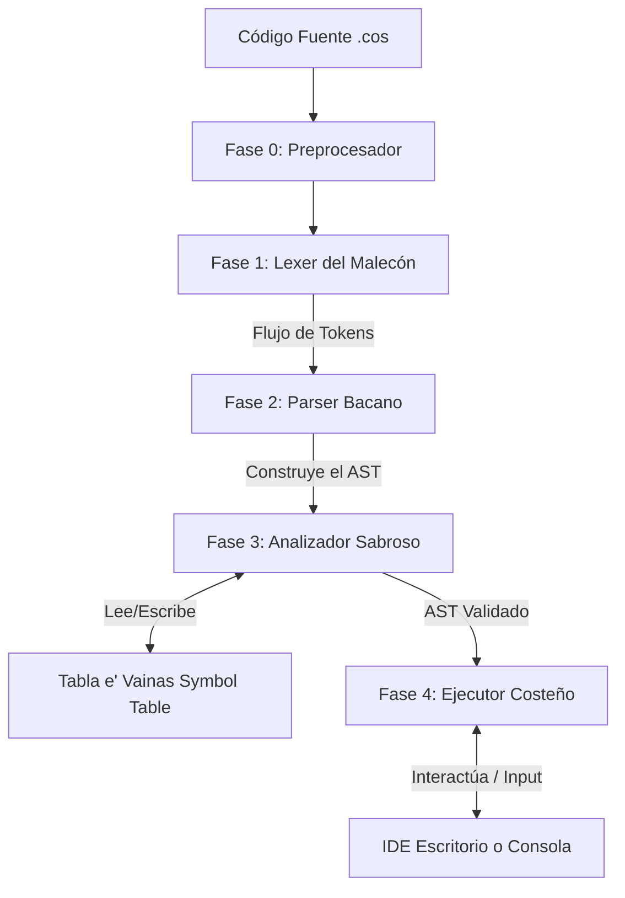

# 🌊 Compilador Costeñol — Guía de Sustentación del Malecón

> *"¡Ajá, cuadro! Bienvenidos al compilador del Malecón. Sin chicharrones y con toda la sabrosura de Barranquilla."*

Este proyecto es un **Compilador e Intérprete Académico** diseñado para el lenguaje **Costeñol**, un dialecto inspirado en la jerga costeña del Caribe colombiano. Ha sido construido utilizando **Python** y la biblioteca **SLY (Sly Lex Yacc)**.

Esta guía está redactada con el rigor teórico necesario para la sustentación ante el jurado/docente, junto con la correspondencia de términos en nuestro dialecto.

---

## 🏛️ 1. Arquitectura y Fases del Compilador

El compilador sigue una arquitectura clásica de **compilación de una sola pasada con ejecución directa sobre el Árbol de Sintaxis Abstracta (Tree-Walking Interpreter)**.



### 📋 Cuadro de Equivalencias Técnicas
| Término Académico | Nombre Costeño | Ubicación de Código | Función Principal |
| :--- | :--- | :--- | :--- |
| **Preprocesamiento** | *Fase Cero* | `src/compiler_api.py` | Normaliza el código (comillas) e interpreta plantillas. |
| **Analizador Léxico** | *Lexer del Malecón* | `src/lexer.py` | Convierte la cadena de caracteres en un flujo de tokens. |
| **Analizador Sintáctico** | *Parser Bacano* | `src/parser.py` | Valida la gramática y estructura el AST jerárquico. |
| **Tabla de Símbolos** | *Tabla e' Vainas* | `src/symbol_table.py` | Almacena y gestiona variables, sus tipos y valores. |
| **Analizador Semántico** | *Analizador Sabroso* | `src/semantic.py` | Verifica la coherencia de tipos y declaraciones. |
| **Intérprete** | *Ejecutor Costeño* | `src/interpreter.py` | Ejecuta las instrucciones evaluando los nodos del AST. |

---

## ⚙️ 2. Detalles Técnicos de las Fases

### 🔹 Fase 0: Preprocesador (`src/compiler_api.py`)
Antes de iniciar el análisis léxico, el código fuente pasa por una fase de normalización estética:
1. **Normalización de Comillas**: Convierte comillas tipográficas curvas (`“`, `”`) a comillas rectas (`"`). Evita que procesadores de texto (como Word o Teams) dañen la compilación.
2. **Traducción de Plantillas**: Traduce expresiones de interpolación especial como `Mensaje.Texto(El resultado es:"sum");` a una concatenación explícita válida: `Mensaje.Texto("El resultado es:" + sum);`. Esto evita ambigüedades en el Parser.

### 🔤 Fase 1: Analizador Léxico (`src/lexer.py`)
Implementado con `sly.Lexer`. Define las expresiones regulares para los terminales del lenguaje:
* **Palabras Clave**: `Entero`, `Texto`, `Real`, `Logico` (tipos), `Captura`, `Mensaje`.
* **Booleanos**: `verdadero`, `falso`.
* **Delimitadores y Operadores**: `+`, `-`, `*`, `/`, `^`, `=`, `;`, `.`, `(`, `)`.
* **Ignorados**: Los comentarios con `//` y los espacios en blanco se descartan automáticamente para no ensuciar el flujo de tokens.

### 🌳 Fase 2: Analizador Sintáctico y AST (`src/parser.py`)
Utiliza algoritmos **LALR(1)** provistos por `sly.Parser`.
* **Precedencia de Operadores**: Define la jerarquía matemática y lógica (desde `^` y unarios en la parte superior hasta operadores lógicos `||`, `&&` y comparadores en la inferior).
* **Mecanismo de Recuperación de Errores**: Implementa `errok()` para reanudar el análisis tras detectar una inconsistencia (avanzando hasta el siguiente `;`).
* **Deduplicación de Errores**: Evita propagaciones masivas limitando el reporte a **un único mensaje de error por línea**.
* **Construcción del AST**: Genera una estructura jerárquica con clases definidas en `src/ast_nodes.py` (ej. `NodoAsignacion`, `NodoOperacion`, `NodoMensaje`).

### 🧠 Fase 3: Analizador Semántico (`src/semantic.py`)
Esta fase valida el significado del código y aplica un enfoque de **semántica flexible** diseñado para la usabilidad académica:
1. **Declaración Implícita**: Si el compilador detecta una asignación o captura sobre una variable no declarada previamente, la declara automáticamente de forma dinámica y emite una advertencia (`⚠️ [Advertencia]`), en lugar de abortar con un error fatal.
2. **Compatibilidad Laxa de Tipos**: Las incoherencias de tipos (como asignar una entrada de `Texto` a una variable de tipo `Entero`) no detienen la ejecución. Se emite una advertencia semántica y el compilador delega al intérprete la tarea de convertir el valor en tiempo de ejecución.

### ▶️ Fase 4: Ejecutor / Intérprete (`src/interpreter.py`)
Es un **Intérprete de Árbol (Tree-Walking)**.
* Evalúa recursivamente cada nodo del AST.
* **Manejo de Capturas Interactivas**: Acepta un callback `fn_input` inyectable. En la consola CLI corre con `input()`, pero en la aplicación de escritorio se vincula con un cuadro de diálogo modal de Tkinter (`simpledialog.askstring`) para interactuar directamente desde la ventana gráfica.
* **Conversión Dinámica de Tipos**: Al momento de la asignación, convierte los tipos de datos al formato correspondiente de la variable (por ejemplo, convierte la cadena `"10"` a un entero `10` al guardarse en una variable de tipo `Entero`).

---

## 🧪 3. Análisis Paso a Paso del Caso de Prueba del Docente

El docente evaluará el compilador utilizando el siguiente bloque de código:

```text
num1 Entero;
num2 Entero;
num1=Captura.Texto();
num2=Captura.Entero();
sum=num1+num2);
Mensaje.Texto(El resultado es:”sum”);
```

Así es como reacciona internamente el compilador al presionar **Compilar y Ejecutar**:

```mermaid
chronological
    title Línea por Línea - Ejecución del Caso de Prueba
    Líneas 1 y 2 : Declaración de variables num1 y num2 como Entero.
    Línea 3 : Captura de Texto sobre variable Entero. Semántico emite Advertencia de tipo.
    Línea 4 : Captura de Entero sobre variable Entero. Semántica correcta.
    Línea 5 : Parser detecta paréntesis de cierre extra. Reporta Error Sintáctico y recupera. Semántico declara sum implícitamente.
    Línea 6 : Preprocesador normaliza comillas y traduce plantilla a concatenación de cadenas.
```

### Explicación de las Líneas Críticas:

1. **`num1 Entero;` y `num2 Entero;` (Líneas 1 y 2)**
   * El lexer genera los tokens `[ID, ENTERO, PUNTO_COMA]`.
   * El parser los reduce a `NodoDeclaracion` para cada variable.
   * El semántico los registra en la **Tabla e' Vainas** con tipo `Entero` y valor inicial `None`.

2. **`num1=Captura.Texto();` (Línea 3)**
   * **Semántica Flexible**: `num1` fue declarada como `Entero`, pero se le asigna una captura de `Texto`. El analizador semántico detecta el mismatch de tipos y genera una advertencia:
     > `⚠️ 'num1' es Entero pero Captura.Texto() captura un Texto (línea 3). Costeñol intentará convertir, cuadro.`
   * **Ejecución**: El motor solicita el dato. Si el usuario ingresa `"10"`, el intérprete lo recibe como texto y lo convierte internamente a `int` (`10`) antes de escribirlo en la Tabla de Símbolos, manteniendo la coherencia de tipos.

3. **`sum=num1+num2);` (Línea 5 — Con error)**
   * **El Error Sintáctico**: Contiene un paréntesis de cierre `)` huérfano.
   * **Recuperación**: El parser detecta que la estructura no corresponde a una asignación válida, lanza un error amigable, y gracias a `errok()` ignora el token inesperado y se desplaza al siguiente punto y coma para continuar el programa sin colapsar.
   * **Error Reportado**:
     > `🚨 Error sintactico en la linea 5: token inesperado ')'. Revisa la sintaxis de esa instruccion, cuadro.`
   * **Declaración Implícita**: La variable `sum` no fue declarada en las primeras líneas. El analizador semántico la detecta y la registra automáticamente en la tabla de símbolos como tipo `Entero` (deducido del resultado de sumar dos enteros) lanzando su advertencia:
     > `⚠️ 'sum' no fue declarada (línea 5). Costeñol la declaró automáticamente como Entero.`

4. **`Mensaje.Texto(El resultado es:”sum”);` (Línea 6)**
   * **Fase 0**: El preprocesador identifica las comillas tipográficas `”` y el formato de plantilla de salida.
   * Transforma el nodo a: `Mensaje.Texto("El resultado es:" + sum);`.
   * El parser procesa este nuevo código sin conflictos de ambigüedad.
   * **Ejecución**: Evalúa la concatenación `"El resultado es: "` con el valor numérico de `sum` (ej. `15`), generando e imprimiendo la cadena `"El resultado es: 15"`.

---

## 🚀 4. Guía de Inicio Rápido y Demostración

### 📥 1. Instalación de Dependencias
Asegúrate de contar con Python 3.8+ instalado y ejecuta:
```bash
pip install sly colorama
```

### 🖥️ 2. Ejecutar la IDE de Escritorio (Tkinter)
Para iniciar la interfaz de usuario nativa:
```bash
py ide_desktop.py
```
*   **Nota**: En Windows, si tienes problemas con caracteres especiales en el editor, ejecuta la IDE forzando UTF-8: `py -X utf8 ide_desktop.py`.

### 🌐 3. Ejecutar la IDE Web (Servidor Flask)
Si deseas presentar la IDE en un navegador web (interfaz premium responsiva):
1. Instala Flask: `pip install flask`
2. Ejecuta el servidor:
   ```bash
   py ide_server.py
   ```
3. Abre tu navegador en: **`http://localhost:5000`**

### 🧪 4. Ejecutar el Script de Sustentación Directo
Si quieres hacer una demostración limpia por terminal donde el compilador procesa consecutivamente el código con errores del docente y luego su variante corregida (inyectando respuestas automáticas):
```bash
py test_docente.py
```

---

## 🌴 5. Glosario de Mensajes Costeños en Compilación
El compilador está diseñado para dar feedback técnico utilizando localismos amigables del Caribe:

*   `Barro, cuadro... el programa terminó de forma inesperada`: Error fatal al final del archivo (EOF abrupto).
*   `Cule chicharrón sintáctico...`: Estructura gramatical no válida.
*   `Chicharrón en el Analizador Sabroso...`: Error de análisis semántico.
*   `Chicharrón matemático: no puedes dividir por cero, cuadro`: Excepción de división por cero atrapada en el intérprete.
*   `¡Bacano! El código corrió sin chicharrones`: Ejecución 100% exitosa del script.

---
*Desarrollado con fines académicos y de divulgación sobre la construcción de compiladores.* 🌊
